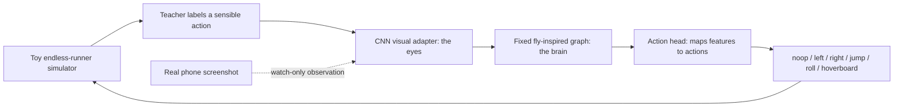

# Fly-Brain Runner

## Start here if you are new

This repository is a safe research sandbox for teaching a small visual model
to play an endless-runner-style game. It is **not** the Subway Surfers app,
and the current model is **not** a real-game bot.

### The one-sentence explanation

We made a repeatable toy game, trained controllers inside it, and connected a
small visual front-end to a fixed fruit-fly-inspired neural graph. We test the
model on new, unseen simulator layouts so we can catch overfitting.

### What works right now

- The simulator has three lanes, trains, barriers, tunnels, ramps, gaps,
  coins, and several power-ups.
- The selected model reads simulator pixels and chooses `noop`, `left`,
  `right`, `jump`, `roll`, or `hoverboard`.
- Training has deterministic seeds and held-out evaluation bands.
- The browser viewer shows the model acting in the toy game.
- The Android tool can inspect real phone screenshots in **watch-only mode**.

### What does not work yet

- The model has not learned Subway Surfers' real visual appearance.
- The current workflow sends no model actions to a phone.
- A phone screenshot prediction is not a real-game score.
- Real-game adaptation and a faster screen-capture path are still required.

## The pipeline in plain English



The loop is always:

```text
see a frame → choose an action → update the world → receive reward → repeat
```

“Endless” describes the track. For training, we split it into short episodes
(normally 300 steps) so an experiment can reset and be reproduced.

## The three parts people often mix up

Think of the model as eyes, brain, and hands:

1. **CNN / visual adapter — the eyes:** turns an 84×84 pixel frame into 21
   compact visual signals.
2. **Fly graph — the brain:** passes those signals through a fixed slice of the
   published MaleCNS topology: 196 selected neurons and 247 directed edges.
   This is a connectome-inspired engineering model, not the whole fly brain.
3. **Action head — the hands:** reads 84 graph output features and converts
   them into six action scores. It is connected to the graph, but it is not the
   CNN and it is not the fly graph itself.

The selected path is therefore:

```text
84×84×6 pixels → 21 retina values → 196-neuron/247-edge graph
               → 84 graph features → action head → one of 6 actions
```

## Important words without the jargon

- **Environment:** the game world. It accepts an action, moves one step, and
  returns what happened and a reward.
- **Observation:** what the model sees; here it can be numbers or pixels.
- **Seed:** a number that creates one obstacle layout. A new seed is a new
  test situation.
- **Teacher:** a hand-written simulator policy that provides reference actions.
  It helps bootstrap learning; it is not the fly graph.
- **Behavior cloning:** copying the teacher's examples.
- **DAgger:** collecting examples specifically from situations where the
  learner makes mistakes, then teaching those corrections.
- **PPO:** a trial-and-error reinforcement-learning algorithm that changes a
  policy using rewards from the environment. PPO experiments exist here, but
  the selected fly checkpoint is mainly a visual imitation/DAgger result.
- **Recurrent:** a model with memory of previous frames. Recurrent alternatives
  are retained as experiments; the selected retina path is the current graph
  candidate.

## Honest current status

The selected checkpoint is
`results/fly_cns_retina_v1/fly_cns_retina_best.pt`.

These are 100-episode held-out **simulator** results, not Subway Surfers
results:

| simulator profile | mean steps | collision rate |
| --- | ---: | ---: |
| standard | 297.7 | 1% |
| dense | 284.6 | 10% |
| fast | 293.1 | 6% |
| surprise | 295.1 | 4% |

The `surprise` profile is kept out of training. The full experiment history,
rejected candidates, and promotion rules are in `docs/experiment-log.md`.

## Quick start

From the project folder, create the environment once:

```bash
python3 -m venv .venv
./.venv/bin/python -m pip install -r requirements.txt
```

The simulator core is dependency-free. The virtual environment adds
Gymnasium, CPU-only PyTorch, and Stable-Baselines3 for learning scripts.

Run basic checks:

```bash
python3 tests.py
./.venv/bin/python gym_check.py
./.venv/bin/python pixel_check.py
./.venv/bin/python fly_cns_hybrid_check.py
```

Watch the selected model in the local browser viewer:

```bash
./.venv/bin/python play_model.py --rich --full-view --fly-cns-retina \
  --model results/fly_cns_retina_v1/fly_cns_retina_best.pt --open
```

Evaluate it on seed ranges that were not used for training:

```bash
./.venv/bin/python evaluate_fly_cns_retina.py \
  results/fly_cns_retina_v1/fly_cns_retina_best.pt \
  --episodes 100 --seed-start 5000 --seed-start 6000 \
  --seed-start 7000 --seed-start 8000
```

## How learning is organized

1. Prove the simulator is solvable with a hand-written teacher.
2. Train a pixel policy with behavior cloning and DAgger.
3. Feed the learned visual signals into the fixed fly graph.
4. Evaluate on seed ranges never used for training.
5. Keep a candidate only when its collision, survival, and pickup metrics pass
   the promotion gate.

## Project map

- `env.py`, `gym_env.py` — game rules and Gymnasium adapters.
- `play_model.py` — local browser viewer.
- `train_visual_teacher.py`, `train_fly_cns_retina.py` — visual and graph-path
  training.
- `evaluate_fly_cns_retina.py` — held-out evaluation and promotion gate.
- `male_cns_neuron_graph.py` — fixed 196-neuron/247-edge graph.
- `data/` — reduced connectome manifests and body annotations.
- `results/fly_cns_retina_v1/` — selected simulator checkpoint.
- `docs/` — detailed environment, experiment, connectome, and Android notes.

## Real-phone boundary

The current checkpoint can be run against Android screenshots only as an
observer. It predicts an action and logs it, but sends no taps, swipes, key
events, purchases, or ad interactions. This is intentional: the model was
trained on the toy renderer and phone capture is not yet fast enough for a
reliable full-speed controller.

With USB debugging enabled and the phone connected:

```bash
./.venv/bin/python watch_android_fly.py \
  results/fly_cns_retina_v1/fly_cns_retina_best.pt \
  --serial YOUR_DEVICE_SERIAL --crop 0,0,1220,2712 --steps 20 \
  --log results/android_observation/fly_watch_only.jsonl
```

Replace `YOUR_DEVICE_SERIAL` with the value shown by `adb devices`. The output
means “what the model would choose,” not “what the phone executed.”

## Read next

1. `docs/goal-rich-subway-visual-env.md` — simulator scope and limitations.
2. `docs/male-cns-subgraph.md` — connectome source and reduction.
3. `docs/experiment-log.md` — experiments, failures, and selection decisions.
4. `docs/android-testing.md` — screenshot calibration and watch-only testing.

Milestone 0 is a tiny, dependency-free Subway-Surfers-like environment. It is
not the real Subway Surfers app. It gives us a stable world to test before the
fly connectome enters the project.

## What is in this folder?

- `env.py` — three lanes, obstacles, actions, rewards, collisions, and seeded resets.
- `tests.py` — small checks for the game rules.
- `demo.py` — a hand-written dodge policy that proves the environment can be played.
- `benchmark.py` — random and heuristic baselines for the first comparison.
- `gym_env.py` — Gymnasium adapter exposing the numeric observation.
- `docs/goal-rich-subway-visual-env.md` — scope and acceptance checks for the
  rich Subway-style visual-RL milestone.
- `gym_check.py` — official environment check plus a random smoke test.
- `pixel_check.py` — official check for the 84x84 RGB observation.
- `requirements.txt` — the tested RL dependencies for PPO.
- `train_ppo.py` — train the MLP PPO baseline, or CNN PPO with `--pixels`.
- `evaluate_ppo.py` — evaluate a saved numeric or pixel model on fixed seeds.
- `train_recurrent_cnn.py` — train recurrent CNN PPO on the partial view.
- `evaluate_recurrent_cnn.py` — evaluate the recurrent CNN with state resets.
- `rich_benchmark.py` — compare random, survival, and soft risk/reward teachers.
- `rich_numeric_probe.py` — guarded numeric PPO training with seed-band checks.
- `evaluate_numeric_probe.py` — audit numeric checkpoints on disjoint seeds.
- `train_visual_teacher.py` — bootstrap and DAgger-train a pixel policy.
- `evaluate_visual_teacher.py` — audit visual closed-loop survival by level.
- `train_visual_ppo.py` — experimental PPO fine-tuning from a visual checkpoint.
- `evaluate_visual_ppo.py` — audit PPO visual checkpoints on held-out levels.
- `train_visual_temporal.py` — experimental four-frame DAgger policy.
- `evaluate_visual_temporal.py` — audit the temporal visual experiment.
- `train_visual_nearfield.py` — train the appended near-field view experiment.
- `analyze_visual_failures.py` — inspect disagreement, collision, and recent action timing.
- `visual_check.py` — check the visual policy tensor contract.
- `fly_graph.py` — reduced sparse graph-shaped visual feature extractor.
- `graph_check.py` — check graph dimensions, sparsity, and a visual receptor.
- `train_graph_ppo.py` — train the reduced graph with recurrent PPO.
- `evaluate_graph_ppo.py` — evaluate the reduced graph on fixed seeds.
- `fetch_male_cns_subgraph.py` — fetch a small real MaleCNS type-level slice.
- `docs/male-cns-subgraph.md` — source, reduction, limitations, and next step.
- `male_cns_graph.py` — fixed graph extractor driven by that real slice.
- `male_cns_check.py` — check the fixed graph and its frozen parameters.
- `train_male_cns_ppo.py` — train the recurrent/action readout.
- `evaluate_male_cns_ppo.py` — evaluate the real-connectome controller.
- `fetch_male_cns_neuron_subgraph.py` — select a route-preserving neuron slice.
- `male_cns_neuron_graph.py` — fixed individual-neuron graph extractor.
- `male_cns_neuron_check.py` — check the neuron graph and randomized control.
- `train_male_cns_neuron_ppo.py` — train fixed or plastic neuron graphs with a resource guard.
- `evaluate_male_cns_neuron_ppo.py` — evaluate neuron-level models on held-out rich levels.
- `train_male_cns_visual.py` / `evaluate_male_cns_visual.py` — audit learned
  retina/action-head graph ablations.
- `train_fly_cns_retina.py` / `evaluate_fly_cns_retina.py` — train and audit
  the graph-only action path from a learned visual retina.
- `train_fly_cns_hybrid.py` / `evaluate_fly_cns_hybrid.py` — audit a bounded
  residual branch beside the selected near-field policy.
- `fly_cns_hybrid_check.py` — check base fallback and graph-path connectivity.
- `browser_cdp.py` — controlled Brave/CDP page bridge for the Poki game.
- `browser_pipeline.py`, `browser_model.py` — browser frame format and policy.
- `record_browser_game.py` — record human browser play with page-level key labels.
- `browser_dataset_check.py` — validate browser recordings and action balance.
- `train_browser_bc.py` — train the browser behavior-cloning checkpoint.
- `run_browser_policy.py` — watch or explicitly execute the browser checkpoint.
- `android_bridge.py` — small ADB screen-capture and gesture bridge.
- `android_check.py` — test the ADB command mapping without a phone.
- `capture_android_frame.py` — save one phone screenshot for viewport calibration.
- `capture_android_sequence.py` — save labelled frame/action data, dry-run by default.
- `run_android_policy.py` — dry-run or explicitly execute a recurrent policy on screenshots.
- `run_android_session.py` — bounded supervised sessions with automatic app reset, start, gating, and logs.
- `android_session_check.py` — offline checks for the session safety gate.
- `docs/android-testing.md` — gated phone calibration and testing procedure.
- `play_model.py` — local browser viewer for watching the toy-game controller live.
- `viewer_check.py` — check the viewer encoder and model step.
- `fly_features.py` — sparse sensory projection for the first fly-inspired model.
- `fly_check.py` — check the sparse extractor before training.
- `train_fly_ppo.py` — train the sparse recurrent fly-inspired policy.
- `evaluate_fly_ppo.py` — evaluate the recurrent policy with hidden-state resets.
- `train_sparse_ppo.py` — train the sparse fly-inspired policy with ordinary PPO.

## How the loop works

```text
observation → hand-written policy → action → world update → reward
```

The five actions are:

```text
0 noop   1 left   2 right   3 jump   4 roll
```

Obstacle types are:

- `block` — requires changing lanes;
- `jump` — requires jumping;
- `roll` — requires rolling.

## Run it

From this folder:

```bash
python3 tests.py
python3 demo.py
python3 benchmark.py

# after creating the virtual environment
./.venv/bin/python gym_check.py
./.venv/bin/python pixel_check.py
./.venv/bin/python train_ppo.py --timesteps 20000
./.venv/bin/python evaluate_ppo.py results/mlp_ppo/mlp_ppo.zip
./.venv/bin/python train_ppo.py --pixels --timesteps 20000
./.venv/bin/python evaluate_ppo.py --pixels results/cnn_ppo/cnn_ppo.zip
./.venv/bin/python train_ppo.py --partial-pixels --timesteps 12000
./.venv/bin/python evaluate_ppo.py --partial-pixels results/cnn_partial_ppo/cnn_partial_ppo.zip
./.venv/bin/python train_recurrent_cnn.py --timesteps 12000
./.venv/bin/python evaluate_recurrent_cnn.py results/recurrent_cnn_ppo/recurrent_cnn_ppo.zip
./.venv/bin/python graph_check.py
./.venv/bin/python train_graph_ppo.py --timesteps 12000
./.venv/bin/python evaluate_graph_ppo.py results/fly_graph_recurrent_ppo/fly_graph_recurrent_ppo.zip
./.venv/bin/python train_graph_ppo.py --dense --timesteps 12000
./.venv/bin/python evaluate_graph_ppo.py results/dense_fly_recurrent_ppo/dense_fly_recurrent_ppo.zip
./.venv/bin/python fetch_male_cns_subgraph.py
./.venv/bin/python male_cns_check.py
./.venv/bin/python train_male_cns_ppo.py --timesteps 12000
./.venv/bin/python evaluate_male_cns_ppo.py results/male_cns_recurrent_ppo/male_cns_recurrent_ppo.zip
./.venv/bin/python fetch_male_cns_neuron_subgraph.py --max-neurons-per-type 48
./.venv/bin/python male_cns_neuron_check.py
./.venv/bin/python train_male_cns_neuron_ppo.py --timesteps 12000
./.venv/bin/python evaluate_male_cns_neuron_ppo.py results/male_cns_neuron_recurrent_ppo/male_cns_neuron_recurrent_ppo.zip
./.venv/bin/python train_male_cns_neuron_ppo.py --randomized --timesteps 12000
./.venv/bin/python evaluate_male_cns_neuron_ppo.py results/male_cns_neuron_random_recurrent_ppo/male_cns_neuron_random_recurrent_ppo.zip
./.venv/bin/python train_male_cns_neuron_ppo.py --trainable-edges --timesteps 50000 --output-dir results/male_cns_neuron_plastic_50k
./.venv/bin/python evaluate_male_cns_neuron_ppo.py results/male_cns_neuron_plastic_50k/male_cns_neuron_plastic_recurrent_ppo.zip --episodes 100
./.venv/bin/python train_male_cns_neuron_ppo.py --rich --full-view --level-variant mixed \
  --trainable-edges --timesteps 50176 --output-dir results/male_cns_neuron_rich_plastic_50k
./.venv/bin/python evaluate_male_cns_neuron_ppo.py \
  results/male_cns_neuron_rich_plastic_50k/male_cns_neuron_plastic_full_rich_recurrent_ppo.zip \
  --rich --full-view --level-variant surprise --episodes 20 --seed-start 5000
./.venv/bin/python android_check.py
./.venv/bin/python android_session_check.py
./.venv/bin/python play_model.py --open
./.venv/bin/python fly_check.py
./.venv/bin/python train_fly_ppo.py --timesteps 20000
./.venv/bin/python evaluate_fly_ppo.py results/fly_sparse_recurrent_ppo/fly_sparse_recurrent_ppo.zip
./.venv/bin/python train_sparse_ppo.py --timesteps 100000
./.venv/bin/python evaluate_ppo.py results/fly_sparse_ppo/fly_sparse_ppo.zip
```

The runner core has no third-party dependency. Gymnasium, CPU-only PyTorch,
and Stable-Baselines3 are installed in the local `.venv` for PPO.

## Pixel observation

`PixelGymRunnerEnv` uses the same game state and rewards, but returns an
`84x84x3` RGB frame. The player is green, blocks are red, jump obstacles are
orange, and roll obstacles are blue. This is intentionally a toy visual scene;
it lets us test vision and memory without connecting to a phone or the real
Subway Surfers app.

`PartialPixelGymRunnerEnv` uses the same frame but hides all obstacle graphics
on every other timestep. The recurrent policy can remember the last visible
obstacle; the feed-forward CNN cannot.

`RichPixelGymRunnerEnv` adds decision-equivalent Subway-style trains, including
long roof-capable trains and faster oncoming trains, plus gaps, barriers,
tunnels, ramps, compound routes, coins, keys, hoverboards, jetpacks, super
sneakers, coin magnets, multipliers, pogo boosts, speed pads, and mystery
boxes. It adds a sixth `hoverboard` action and is a training environment only;
it is not the real Subway Surfers app. Train it with:

```bash
./.venv/bin/python train_recurrent_cnn.py --rich --timesteps 20000
./.venv/bin/python evaluate_recurrent_cnn.py \
  results/rich_recurrent_cnn_ppo/rich_recurrent_cnn_ppo.zip --rich --episodes 20
./.venv/bin/python train_recurrent_cnn.py --rich --curriculum --timesteps 20000
./.venv/bin/python evaluate_recurrent_cnn.py \
  results/rich_curriculum_recurrent_cnn/rich_recurrent_cnn_ppo.zip --rich --episodes 20
./.venv/bin/python rich_benchmark.py
./.venv/bin/python rich_numeric_probe.py --timesteps 65536
./.venv/bin/python rich_numeric_probe.py --rich-layer 1 --timesteps 32768
./.venv/bin/python rich_numeric_probe.py --timesteps 131072 --n-envs 4
./.venv/bin/python rich_numeric_probe.py --timesteps 131072 --n-envs 4 \
  --train-level dense --eval-level dense --curriculum
./.venv/bin/python evaluate_numeric_probe.py \
  results/rich_mlp_dense_curriculum_131072/rich_numeric_probe.zip \
  --level-variant dense --seed-start 2000
./.venv/bin/python train_visual_teacher.py --dagger-level dense
./.venv/bin/python evaluate_visual_teacher.py \
  results/visual_dagger_dense/visual_teacher_best.pt --episodes 100
```

The recurrent CNN trainer is desktop-safe by default: it uses two PyTorch CPU
threads, lowers its scheduling priority, checkpoints every 2,048 steps, and
stops if its memory or system-available-memory guard is reached. Run
`resource_guard_check.py` before changing those limits.

The rich environment intentionally collapses cosmetic and seasonal variants
into shared collision/equipment rules. See
`docs/goal-rich-subway-visual-env.md` for the exact boundary.

`rich_benchmark.py` checks that the symbolic task is solvable before visual
training. `rich_numeric_probe.py` is a guarded diagnostic for the readable
numeric state; neither result is evidence of real-game competence.

For the numeric policy, use `evaluate_numeric_probe.py` on disjoint seed bands
and choose by held-out survival, not by training reward. The current robust
checkpoint is the mixed-level four-environment MLP at
`results/rich_mlp_mixed_131072/rich_numeric_probe.zip`; it is still a simulator
diagnostic, not a real Subway Surfers controller.

The current visual candidate is a small CNN trained from the verified teacher,
then improved with dense-focused DAgger recovery frames. It survives the
simulator's held-out standard/dense/fast seed bands with approximately
0–1%/4–10%/2–4% collision rates respectively, and 0–4% on the isolated
surprise profile. The current checkpoint appends
a vertically enlarged near-track view to the original pixels. Watch it with:

```bash
./.venv/bin/python play_model.py --rich --full-view --visual-teacher \
  --near-field --model results/visual_nearfield_v1/nearfield_visual_teacher_best.pt --open
```

Repeat the held-out audit with:

```bash
./.venv/bin/python evaluate_visual_teacher.py \
  results/visual_nearfield_v1/nearfield_visual_teacher_best.pt --near-field --episodes 100 \
  --seed-start 5000 --seed-start 6000 --seed-start 7000 --seed-start 8000
```

Test only the held-out surprise profile with `--level surprise`.

This is still a visual imitation/DAgger bootstrap, not PPO and not a
real-game controller. Keep the older checkpoint for comparison.

A four-frame temporal experiment was also tested, but its dense collision
rate rose to 29–33%, so it is not selected.

A critical-frame DAgger sampler was also tested; it reached 11–20% dense and
6–14% fast collisions on the same held-out bands, so it is not selected.

An ordinary PPO transfer probe is available but currently rejected: its first
run degraded sharply on the held-out levels. Do not substitute
`results/visual_ppo_v1/visual_ppo.zip` for the DAgger checkpoint. PPO needs a
behavior-preserving constraint or temporal representation before it can be
accepted. A guarded teacher-guided follow-up is also rejected for now; the
timing-only recovery rules are also rejected. The near-field representation is
selected, with v2 kept as a rollback baseline. The wider static DAgger
experiment is also kept only for comparison because its dense collision rate
rose to 12–24%.

To watch the rich model in the browser:

```bash
./.venv/bin/python play_model.py --rich --full-view \
  --model results/rich_recurrent_cnn_ppo/rich_recurrent_cnn_ppo.zip --open
```

While training, the viewer can reload the newest checkpoint automatically:

```bash
./.venv/bin/python play_model.py --rich --full-view \
  --model results/rich_live_training/checkpoints/rich_recurrent_cnn_2048_steps.zip \
  --watch-checkpoint-dir results/rich_live_training/checkpoints --port 8766
```

`FlyGraphExtractor` is the first graph-shaped controller for the visual task.
It has fixed lane-local receptor pooling and masked sparse edges. It is a
connectome-inspired engineering model, not a graph copied from the real fruit
fly connectome yet.

The first real-data slice is now stored in
`data/male_cns_visual_subgraph.json`. It contains six published neuron types
(`R1-R6`, `L1`, `L2`, `L3`, `DNc01`, and `DNc02`) and 30 aggregated directed
type-level edges. See `docs/male-cns-subgraph.md` for the exact queries and
the reduction boundary.

`MaleCNSGraphExtractor` keeps those 30 edges fixed, repeats the type graph
over three lane channels, and exposes the two descending types to a recurrent
readout. Its graph has zero trainable parameters. On the matched 12,288-step
partial-view run it reached `mean_steps=57.6` and `collision_rate=1.00`, the
same score as the dense-retina control. That is a successful data/wiring
integration, not a claim that the fly model has solved the game.

The richer neuron-level manifest contains 196 selected neurons and 247 real
body-level edges. `MaleCNSNeuronGraphExtractor` preserves that topology,
injects the 21 pooled visual channels into selected `R1-R6` neurons, and
reads four DNc neurons as 84 features. The fixed graph is not enough under the
short budget, but the fixed-topology plastic-edge variant reaches the full
300-step timeout on 100 evaluation seeds after 50,176 collected steps. It
also passes 20-seed tests at higher speed and obstacle density. The checkpoint
is `results/male_cns_neuron_plastic_50k/male_cns_neuron_plastic_recurrent_ppo.zip`.
That checkpoint uses training seed 7; separate seeds 1 and 2 are documented in
`docs/experiment-log.md` and show that convergence remains initialization-sensitive.

That plastic result is from the simpler runner. A guarded 50,176-step rich
run was also tested with the same six-action interface and mixed
standard/dense/fast training levels. The fixed graph reached `50.5/35.5/35.9`
mean steps on standard/dense/fast held-out seeds, and `30.6` on surprise; all
four collision rates were `1.00`. Learning the 247 edge gains produced the
same held-out result. These rich checkpoints are retained as negative controls;
the near-field visual DAgger policy remains the selected rich simulator model.

## Current fly-brain visual path

The first pure graph runs failed because flat lane boxes and three generic color
signals discarded the rich renderer's perspective, behavior cues, and timing
state. The retina now follows the trapezoidal lanes, caches its masks for fast
inference, and emits the same 21-value contract as before. The neuron graph is
still the selected 196-neuron MaleCNS slice with 247 real edges and four DNc
outputs (84 graph features).

The accepted research candidate is a stricter path:

```text
84x84x6 near-field pixels
        ↓ frozen visual adapter
21 learned receptor values
        ↓ fixed MaleCNS topology: 196 neurons / 247 edges
84 DNc graph features
        ↓ action head
noop / left / right / jump / roll / hoverboard
```

The visual adapter only translates pixels into receptors; it does not produce
the action logits. The action head receives only the graph output. Its
checkpoint is `results/fly_cns_retina_v1/fly_cns_retina_best.pt`.

The larger confirmation on the held-out `5000` seed band reached:

| level | mean steps | collision rate |
| --- | ---: | ---: |
| standard | 297.7 | 0.01 |
| dense | 284.6 | 0.10 |
| fast | 293.1 | 0.06 |
| surprise | 295.1 | 0.04 |

The four-band pilot (20 episodes per band) stayed within 0–5% standard,
0–10% dense, 5–15% fast, and 0–5% surprise collisions. Zeroing the graph
output on the same dense/fast pilot caused 100% collisions and roughly 33–42
mean steps, so the graph is materially in the decision path. These are local
simulator results only; the model has not learned Subway Surfers' real pixels.

Reproduce the training and audits with:

```bash
./.venv/bin/python fly_cns_hybrid_check.py
./.venv/bin/python train_fly_cns_retina.py --output-dir results/fly_cns_retina_v1
./.venv/bin/python evaluate_fly_cns_retina.py \
  results/fly_cns_retina_v1/fly_cns_retina_best.pt --episodes 100 \
  --seed-start 5000
./.venv/bin/python evaluate_fly_cns_retina.py \
  results/fly_cns_retina_v1/fly_cns_retina_best.pt --episodes 20 \
  --seed-start 5000 --seed-start 6000 --seed-start 7000 --seed-start 8000 \
  --disable-graph
./.venv/bin/python play_model.py --rich --full-view --fly-cns-retina \
  --model results/fly_cns_retina_v1/fly_cns_retina_best.pt --open
```

The residual hybrid is retained as a safe fallback experiment. It matches the
near-field CNN, but its fly correction changes only a small fraction of actions
and is not promoted over the graph-only candidate until it shows a held-out
survival improvement.

## Human-like pickup objective and promotion gate

The simulator now has two deliberately separate teachers:

- `teacher_action` is the survival-only control policy used for comparison;
- `human_teacher_action` scores each action with a continuous danger cost and a
  pickup value. A coin is not forbidden near an obstacle: jumping over it,
  changing lanes for it, or collecting it before a distant hazard can win when
  the expected risk is small. A clearly imminent collision still dominates.

The environment reward already reports pickup value (`coin=+0.05`, key `+0.10`,
power-up `+0.20`) alongside survival (`+0.01`) and collision (`-1.0`). The new
teacher makes those rewards visible in BC/DAgger labels instead of changing the
physics or pretending that a reward change alone teaches a classifier.

The training split is kept disjoint:

| purpose | seed bands | used for |
| --- | --- | --- |
| demonstrations | `0–319` | behavior cloning |
| validation | `1000–1049` | checkpoint selection by label accuracy |
| DAgger rollouts | `2000–2299` | recovery-state labels |
| final audit | `5000`, `6000`, `7000`, `8000` | promotion gate |
| surprise audit | same bands, `surprise` level | never used for training |

The final audit reports survival, score, coins, coin capture, near-misses, and
collisions. With `--baseline --gate`, a candidate is rejected if any band has
more than a three-point collision regression, loses more than eight mean steps,
or loses more than `0.25` coins per episode. This is a promotion check, not a
claim of real Subway Surfers competence.

Run the safe candidate experiment without overwriting the selected model:

```bash
./.venv/bin/python rich_benchmark.py --episodes 100 --level-variant dense
./.venv/bin/python train_fly_cns_retina.py \
  --init-checkpoint results/visual_nearfield_v1/nearfield_visual_teacher_best.pt \
  --init-policy results/fly_cns_retina_v1/fly_cns_retina_best.pt \
  --preserve-base \
  --output-dir results/fly_cns_retina_distill_candidate \
  --teacher-policy human --seed 7
./.venv/bin/python evaluate_fly_cns_retina.py \
  results/fly_cns_retina_distill_candidate/fly_cns_retina_best.pt \
  --baseline results/fly_cns_retina_v1/fly_cns_retina_best.pt \
  --episodes 100 --seed-start 5000 --seed-start 6000 \
  --seed-start 7000 --seed-start 8000 --gate
```

The accepted simulator checkpoint remains
`results/fly_cns_retina_v1/fly_cns_retina_best.pt`. Human-objective candidates
are kept in separate result folders until the full four-band gate passes; the
phone/ADB path is not part of this training loop.

## Android boundary

The ADB bridge is prepared but the current checkpoint was trained on the local
toy renderer. It must not be pointed at Subway Surfers as if it already knows
that game's visual language. First connect an Android phone with USB debugging,
capture one frame, and calibrate the game viewport and swipe geometry:

```bash
./.venv/bin/python capture_android_frame.py --output results/android_frame.png
./.venv/bin/python run_android_policy.py results/male_cns_neuron_plastic_50k/male_cns_neuron_plastic_recurrent_ppo.zip --crop left,top,width,height
```

`run_android_policy.py` is a dry run by default and is retained for older PPO
checkpoints. Its optional input path is for future guarded experiments; do not
use `--execute` with a real phone in this project snapshot. Real-game
adaptation starts with screenshot inspection and watch-only validation.

The current selected fly checkpoint is a custom PyTorch .pt graph policy, not
the older recurrent PPO .zip expected by run_android_policy.py. Use the
watch-only adapter for its first real-screen observation:

```bash
./.venv/bin/python watch_android_fly.py \
  results/fly_cns_retina_v1/fly_cns_retina_best.pt \
  --crop 0,0,1220,2712 --steps 10 \
  --log results/android_observation/fly_watch_only.jsonl
```

The watch-only adapter has no execute flag: it captures screenshots, runs the
fly model, prints the top action/confidence, and appends JSONL telemetry. A
prediction on a menu is only an interface check; the model has not learned the
commercial game's visual language.

For a repeatable supervised session, use the lifecycle wrapper instead of
clicking through the game screens by hand:

```bash
./.venv/bin/python run_android_session.py \
  results/male_cns_neuron_plastic_50k/male_cns_neuron_plastic_recurrent_ppo.zip \
  --crop 0,0,1220,2712 --steps 30
```

This observes the currently open screen and sends no phone input. The current
workflow does not use `--execute`; the wrapper's optional input path is retained
only for future guarded experiments. In that future mode it can force-stop and
relaunch Subway Surfers, gate on the visible screen state, and write action
metadata to `results/android_sessions/`. Frames are not saved unless
`--save-frames` is supplied. This is lifecycle automation, not a claim that
the toy-trained checkpoint understands the real game's visuals.

## Browser-game path (Poki)

For the online Poki version, use the browser pipeline rather than the Android
scripts. It opens a controlled Brave window, records key events inside the
game page (including its iframe) with screenshots, trains a separate
five-action policy, and keeps live control watch-only unless `--execute` is
explicitly supplied. Browser frames preserve Poki's 16:9 game view as
`128x72` RGB inputs with smooth downsampling, and training mirrors frames while
swapping left/right labels. Menu/result frames are filtered using the active
game HUD. This works on Wayland/Hyprland without global X11 key capture.

Install the browser bridge once:

```bash
./.venv/bin/python -m pip install -r requirements.txt
```

Record while playing manually:

```bash
./.venv/bin/python record_browser_game.py \
  --duration 120 --fps 15 \
  --output-dir results/browser_dataset_poki
```

The script launches a separate Brave profile. Click the game, start a run, and
use `Escape` to stop recording. The recorder does not send game input. Use
several runs, including recovery situations; the labels are `noop`, `left`,
`right`, `jump`, and `roll`.

Check and train the browser policy:

```bash
./.venv/bin/python browser_dataset_check.py --data-dir results/browser_dataset_poki
./.venv/bin/python train_browser_bc.py \
  --data-dir results/browser_dataset_poki \
  --output-dir results/browser_bc_v1
```

Watch the learned policy before allowing it to press keys:

```bash
./.venv/bin/python run_browser_policy.py \
  results/browser_bc_v1/browser_policy_best.pt \
  --steps 300
```

Only after a good watch-only run, start a short live test with the game
already active:

```bash
./.venv/bin/python run_browser_policy.py \
  results/browser_bc_v1/browser_policy_best.pt \
  --steps 100 --execute
```

Press `Esc` to stop. This browser checkpoint is separate from the toy-game
checkpoint and the Android path. Reinforcement learning comes later, after
we can reliably observe browser score/death signals; the first real step is
human behavior cloning.

## Watch the controller locally

To see the trained controller act in the toy game, run:

```bash
./.venv/bin/python play_model.py --open
```

This opens a browser viewer with the current 84x84 frame, action, reward,
score, pause/resume, step-once, and reset controls. It is a local simulation;
it does not connect to Android or send any device input.

## What comes next

1. Collect a clean real-game frame set and build the visual adapter.
2. Use the session wrapper for bounded, supervised dry-runs and live checks.
3. Compare the adapted controller against the toy-runner checkpoint and keep
   any real-game result separate from the deterministic local benchmark.
